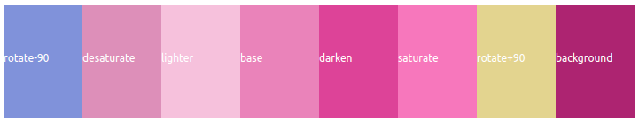

# 🎨 Programmatic Color Palette

<p align="center">
  
</p>

## Generate a beautiful color palette

It start generating randomly a base color in the HSL color format.

Then generate a palette of `8 colors`, each with a unique trait:

- `darken` : light value (L of HSL) is incremented by 15%
- `lighter` : light value (L of HSL) is decremented by 15%
- `saturate` : saturation value (S of HSL) is incremented by 15
- `desaturate` : saturation value (S of HSL) is decremented by 15
- `hueRotationPlus` : hue value (H of HSL) is rotated by 90 degree
- `hueRotationMinus` : hue value (H of HSL) is rotated by -90 degree
- `background` : light value (L of HSL) is incremented by 30%

## 🔗 Useful links

- [a-programmatic-approach-to-design](https://tympanus.net/codrops/2021/12/07/coloring-with-code-a-programmatic-approach-to-design/)

- [lch-colors-in-css](https://lea.verou.me/2020/04/lch-colors-in-css-what-why-and-how/)

- [Sass Color Functions](https://codepen.io/chriscoyier/pen/PawaqP)

> This project was bootstrapped with [Create React App](https://github.com/facebook/create-react-app).

## 🚀 Getting Started

Run the command

```shell
 npm start
```
